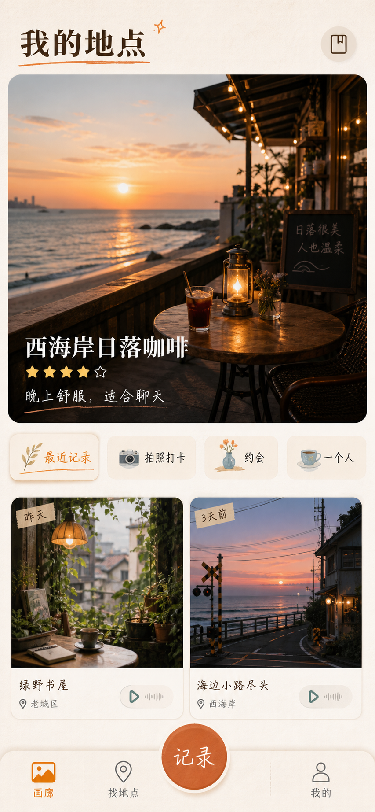
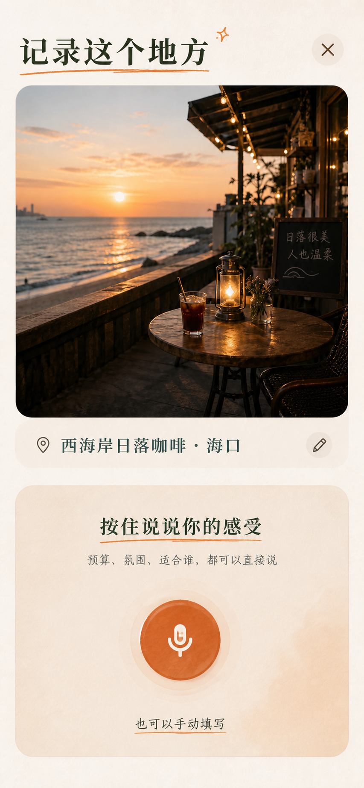
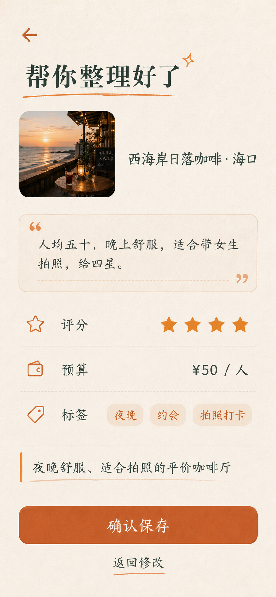
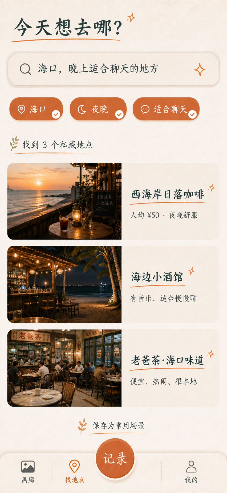
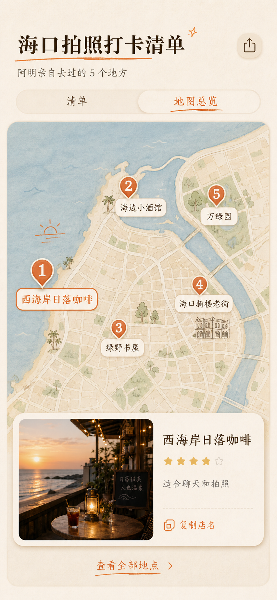

# 个人地点打卡 · V1 产品与技术方案

> **用途**：这是本项目的单一事实来源（SSOT）。GPT 与多智能体协同开发应以本文件为共同规格；任何一方想新增、删减或改变已锁定的行为，先更新本文件并标记原因。
>
> **状态**：立项方案，尚未进入产品代码开发。
>
> **版本**：V1.0 · 2026-09-01

> **维护规则**：产品所有者后续在对话中确认的功能、供应商、账户归属、隐私规则和部署规则，必须先更新到本文件的“已确认输入”或对应规格后，双方再按新版本开发。真实 Key、OAuth Secret、服务端 API Key、密码永远不写入本文件或 Git。

---

## A. 已确认输入与配置交接

本节记录产品所有者已经明确给出的可执行决定。它是给 GPT 开发端与多智能体开发端同步使用的配置事实，不是待讨论的建议。

| 编号 | 范围 | 已确认输入 | 开发执行规则 |
|---|---|---|---|
| C-01 | Supabase | 共用项目 Dashboard：`https://supabase.com/dashboard/project/yacgnikzvutbpoqvokth`；Project Ref：`yacgnikzvutbpoqvokth`。 | 复用此项目，不创建地点工具专用 Supabase 项目；表、bucket、RLS 独立隔离。Dashboard 访问仍取决于用户另行授予账号权限。 |
| C-02 | 登录 | personal-use 首发使用 Google 登录。 | 使用 Supabase Auth 的 Google OAuth；需在 Google Cloud 与 Supabase 后台配置回调，详见第 7.4 节。 |
| C-03 | 默认标签 | 首发预置默认标签。 | 使用第 3.3 节定义的初始维度；用户始终可删除、改名、扩展。 |
| C-04 | 语音转写 | 使用腾讯 ASR。 | 转写适配器先落 Tencent ASR；密钥只通过部署环境变量注入。 |
| C-05 | 大模型 | 首批接入范围：OpenRouter、DeepSeek、OpenCode；“大模型2”用于结构化整理步骤。 | 用可切换 Provider Adapter 实现；在得到具体 Model ID/Endpoint 前可用模拟数据完成 UI，不擅自假设模型名称。 |
| C-06 | 地图 | 使用高德地图。 | PWA 互动地图申请 `Web端(JS API)` Key；地图总览以第 8 节图一为视觉基准。 |
| C-07 | 部署 | 通过 GitHub 导入 Vercel 后部署。 | 使用 Vercel Preview 进行联调，Production URL 取得后配置 Google OAuth 与高德域名白名单。 |
| C-08 | 分享访问 | 拿到链接即可访问。 | 分享页无需登录；必须是字段白名单快照、可撤销、`noindex`，不可回读私人原始记录。 |
| C-09 | 图片 | 后续上传真实照片再决定压缩细节。 | 先实现展示图/缩略图/队列架构与容量提示；不得用测试结论冒充真实照片质量验收。 |

### A.1 明确禁止写入仓库或本文档的值

- Supabase `service_role`、数据库密码、个人 Access Token。
- Google OAuth Client Secret。
- 腾讯 ASR SecretId/SecretKey。
- OpenRouter、DeepSeek、OpenCode 的 API Key。
- 高德 Web 服务 Key、安全密钥，以及任何非浏览器公开配置。

开发端只提交 `.env.example` 的**变量名**；真实值由产品所有者在本地未提交环境文件和 Vercel Environment Variables 中配置。

---

## 0. 一句话定义

一个以手机为主、可安装为 PWA 的私人地点手账：用户拍多张照片并说出感受，系统把它整理为可筛选的地点记录；需要推荐时可按场景找出地点，并把一个地点或一份清单分享出去。

它不是大众点评、美团或社交内容平台；它不要求消费证明，也不把用户的数据和推荐沉淀在平台里。

## 1. V1 的目标、用户与原则

### 1.1 核心场景

1. 用户到一个新地方，拍照并说一句话，例如：“海口西海岸这家咖啡 50 左右，晚上很舒服，适合聊天和拍照，给 4 星。”
2. 系统识别地点与语音，把预算、星级、标签和一句摘要整理好；用户确认后保存。
3. 后来用户要回答“海口哪里适合拍照/约会/一个人待着”，用自然语言或筛选条件立刻找到自己的记录。
4. 用户把一处地点，或“海口拍照打卡清单”分享给朋友；朋友能看照片和理由，并一键复制店名到高德、百度或美团搜索。

### 1.2 V1 成功标准

- 从打开“记录”到本地保存，弱网下也不阻塞；联网后自动同步。
- 用户能用 20–80 个自定义标签建立个人判断体系，而不用每次重想分类。
- 不同设备登录同一账号后可看到同一批记录。
- 分享页默认不泄露原始语音、私密笔记、完整到访历史、原图 EXIF 或未批准的位置。
- 用户能导出自己的结构化数据和媒体清单，数据不被产品锁死。

### 1.3 产品原则（已锁定）

- **照片第一，地点第二，平台最后。** 首屏先让用户回想，而不是先看到表格或地图。
- **记录足够快。** AI 先整理，人最后确认；绝不静默改标签或自动创建标签。
- **私有默认，分享例外。** 每次分享都基于明确选中的内容生成公开快照。
- **本地优先，云端同步。** 本地提升速度与离线能力；云端避免换机或清缓存丢失。
- **美观不牺牲真实。** 地图使用真实坐标与可交互底图，手账气质由界面、标记和素材实现。

### 1.4 已确认的运行配置（2026-09-01）

| 范围 | 已确认决定 |
|---|---|
| Supabase | 使用现有共用项目，Project Ref：`yacgnikzvutbpoqvokth`。不新建地点工具专用项目。 |
| 认证 | personal-use 首发使用 Google 登录；以 Supabase Auth 的 Google OAuth 实现。 |
| 初始标签 | 预置一套可删除、可改名、可扩展的默认标签。 |
| 语音转写 | 使用腾讯 ASR。 |
| AI 整理 | 用可切换的大模型适配层；首批接入配置为 OpenRouter、DeepSeek、OpenCode。 |
| 地图 | 使用高德地图 Web端(JS API)。 |
| 部署 | GitHub 仓库导入 Vercel；先部署取得链接，再配置正式域名。 |
| 公开分享 | 任何拿到有效链接的人可访问；不要求登录；仍可撤销，并应设置 `noindex` 防止搜索引擎收录。 |
| 图片验收 | 先完成上传链路，之后用真实照片测试压缩效果和容量提醒阈值。 |

---

## 2. V1 范围

### 2.1 必做（P0）

| 模块 | V1 行为 |
|---|---|
| 账号与同步 | 有稳定用户身份，支持跨设备同步；同一人只能看见自己的私有记录。 |
| 画廊 | 以照片为主的时间流；按记录浏览，也可按地点归档浏览。 |
| 记录 | 创建地点、一次到访记录、选择多张照片、文字或语音感受、手动编辑。 |
| AI 整理 | 语音转写 + 结构化建议：星级、预算、已有叶子标签、摘要；必须由用户确认。 |
| 标签 | 自定义维度；常规标签仅支持“父 → 子”两层；地区是固定结构。 |
| 找地点 | 标签筛选和自然语言找地点，结果可切换画廊/清单。 |
| 地点归档 | 同一地点的多次到访合并在地点详情内，不单独占主导航页面。 |
| 分享 | 单地点卡片和多地点清单；复制“店名 · 区域”；可撤销。 |
| 地图总览 | 仅用于一份多地点分享清单，显示允许分享的点位。 |
| 数据自主 | 本地草稿队列、云端同步状态、导出入口（V1 至少导出结构化 JSON/CSV 与媒体清单）。 |

### 2.2 明确不做（避免失控）

- 不做公开点评社区、关注、点赞、评论或榜单。
- 不做交易、团购、消费验证、订座或外卖。
- 不做原图云盘/摄影 RAW 备份；系统相册或其他云盘才是原图归档位置。
- 不做“持续定位轨迹”或自动记录到访。
- 不做 Android 原生 App、微信小程序作为首发主端；首发为移动端 PWA 和桌面网页。
- 不做每次请求都用 AI 绘制一张假地图。

---

## 3. 信息架构与页面规格

### 3.1 导航（已锁定）

底部是视觉对称的三个一级入口：**画廊 / 找地点 / 我的**。

“记录”是悬浮在导航正上方的主操作按钮，不被算作第四个页面入口。这样既突出高频动作，又不会出现四个图标不对称的问题。

### 3.2 页面清单

| 页面 | 入口 | 目的与必须行为 |
|---|---|---|
| 画廊（首页） | 默认打开 | 照片瀑布流/卡片流；默认按记录时间倒序；支持下拉继续看历史。顶部提供常用场景筛选。 |
| 画廊：按地点 | 画廊内切换 | 同一地点只显示一张地点卡，标注“去过 N 次”；点入后看该地点全部记录。 |
| 记录 | 悬浮“记录”按钮 | 选照片、确认地点、录音/输入感受、提交给 AI 整理。 |
| AI 确认 | 记录流程 | 展示转写、评分、预算、候选标签与摘要；可逐项改动；确认后才入库。 |
| 记录详情 | 点画廊卡 | 多图相册、到访日期、公开/私密笔记、标签、评分、预算、地点信息；可改封面与发起分享。 |
| 地点详情 | 点“按地点”卡 | 一个地点的全部到访记录，时间线展示；不是新的底部 Tab。 |
| 找地点 | 底部 Tab | 自然语言搜索和结构化筛选；结果支持收藏式画廊、清单，并可选多项创建分享清单。 |
| 标签与维度 | 我的 → 标签与维度 | 管理父标签、子标签、排序、别名与常用场景；没有独立底部 Tab。 |
| 我的 | 底部 Tab | 标签与维度、常用场景、数据导出、隐私与 AI、同步状态。 |
| 单地点分享页 | 分享链接 | 一张照片推荐卡 + 极简详情；可复制店名去外部地图/美团搜索。 |
| 多地点分享页 | 分享链接 | 默认清单视图，第二视图为地图总览。 |

### 3.3 关键交互规则

#### 画廊与地点归档

- 每条**记录**可以有多张照片；默认第一张是封面，用户可改为任意一张。
- 画廊卡显示封面，其他照片以 `+N` 提示；详情页显示完整相册。
- 同一地点的多次记录不会被强行合并：它们在“按记录”中仍是独立回忆，在“按地点”中才聚合。

#### 标签

- 叶子标签才实际存入记录；父级由关系推导，避免同时存“美食”和“海南菜”造成混乱。
- 例：`地区：海南省 → 海口市`，`类型：美食 → 海南菜`，`场景：约会 / 拍照打卡 / 一个人放空`。
- 详情页以人话展示：`地区：海南省 · 海口市`、`类型：美食 · 海南菜`、`场景：约会、拍照打卡`；画廊卡只露出叶子标签。
- AI 只能映射到已有标签；找不到时提出建议，例如“未找到匹配标签：适合带长辈 [加入场景] [暂不添加]”。

#### V1 预置默认标签（用户可随时删改）

| 维度 | 初始结构 |
|---|---|
| 地区（系统维度） | `海南省 → 海口市 / 儋州市` 作为首批示例；之后按“省 → 市”添加。 |
| 类型 | `美食 → 海南菜 / 火锅 / 海鲜 / 小吃`；`咖啡茶饮 → 咖啡 / 茶饮`；`酒吧夜生活`、`自然风景`、`运动体验`、`文化展览`、`住宿`。 |
| 场景 | `约会`、`拍照打卡`、`女生拍照`、`一个人放空`、`朋友小聚`、`适合聚餐`。 |
| 人群 | `一个人`、`情侣`、`朋友`、`家庭`。 |
| 结构化字段（非普通标签） | 星级 1–5、预算区间、到访日期、地点名称、地区、公开状态。 |

这套预置只为减少第一次建库成本，不应限制用户建立自己的维度；普通维度仍遵循父 → 子两层上限。

#### 找地点

- 用户可直接说/输入“海口适合女生拍照、预算 100 内的地方”。
- 系统把语句解析为确定的筛选条件：地区、预算、星级、活动类型、人群和标签 ID；查询本身仍由数据库确定执行。
- 搜父标签会包含所有子标签。例如筛“海南省”包含海口、儋州等子城市；筛“美食”包含火锅、海南菜等。

---

## 4. 分享与地图规格

### 4.1 单地点分享

分享对象是“照片推荐卡 + 最小分享详情”，不是一条私人记录的全量镜像。

**卡片必含**：封面照片、地点名、区域、星级、预算（若公开）、一段公开推荐理由、少量公开标签、`复制「店名 · 区域」去搜索`。

**默认不含**：原始语音、私密感受、完整到访历史、没有被选中的照片、原图 EXIF、精确坐标。

### 4.2 多地点分享

- 用户从“找地点”结果中勾选多处地点，创建一个命名清单，例如“海口拍照打卡清单”。
- 分享的是一个链接，落地页先呈现照片与推荐理由的清单，而不是五张零散卡片。
- 支持每行复制店名，也支持“复制全部店名”。
- 分享内容是**快照**：之后私有库的修改不改写已分享内容；所有者可撤销链接。

### 4.3 地图总览（视觉与交互已锁定）

- 首期底图采用高德地图 JavaScript 能力；高德负责真实地理、缩放、拖动与坐标。
- 地图只显示本次清单中“允许公开且坐标精度允许”的地点。私密地点默认不打点，或只显示模糊区域。
- 点位为暖橙手账风的**编号 + 短名称名牌**，不是通用蓝色图钉；编号与清单顺序一一对应。
- 点名牌后在底部展开：封面、地点名、评分、一句理由、复制店名按钮。
- 点清单行应使地图定位并高亮对应点位。
- 地点密集或缩放很远时，隐藏长名称，仅保留编号；近距离重叠可聚合为数量点，放大后展开。
- 手账感来自米色低饱和地图样式、纸张纹理、编号名牌和轻量插画；**不能**依赖 AI 每次重画地图。

---

## 5. 图片与语音策略

### 5.1 图片：高质量展示，不做原图备份

| 资产 | 用途 | V1 规则 |
|---|---|---|
| 原图 | 用户自己的影像档案 | 默认留在系统相册/iCloud 等原始相册，不自动上传到本工具。 |
| 高质量展示图 | 详情、全屏查看、分享 | 客户端压缩后上传；最长边建议约 2560px，保证手机和网页看起来清晰。 |
| 缩略图 | 画廊快速滚动 | 客户端生成小尺寸版本；只用于列表预览。 |
| 分享图 | 公开页面 | 只从用户明确批准的展示图生成/复制，不公开私有原图。 |

- 一个地点可以累计很多照片和多次到访；批量上传必须采用可恢复的后台队列。
- 默认界面引导一次记录优先挑 1–9 张代表照，但不把“9 张”误当成一个地点的硬上限。
- 若用户一次选择 353 张，先估算压缩后的体积并提示 Storage 风险，再允许排队上传；绝不把 353 张原图直接塞进免费空间。
- 记录拍摄时间、经确认的地点信息；对公开图片清除不需要公开的 EXIF/GPS。

### 5.2 语音与 AI

1. 客户端录音或上传语音，先做语音转写。
2. 服务端调用 AI，要求返回固定 JSON：`score`、`budget`、`candidate_tag_ids`、`summary`、`unmatched_suggestions`、`confidence`。
3. 用户在 AI 确认页决定接受、修改或删除；确认前不更新正式记录。
4. V1 默认保存已确认的文字转写与最终结构化结果；**原始音频默认不长期保存**，可在设置中另行开启。
5. 模型密钥只保留在服务端环境变量；浏览器不得持有服务端密钥。

---

## 6. 数据、同步与安全方案

### 6.1 总体决定

使用现有的**一个共用 Supabase 项目**承载多个个人小工具；本项目不新开一个 Supabase 项目。当前目标项目为 `yacgnikzvutbpoqvokth`。

这不等于所有工具共用一张大表。每个工具使用独立的表群、独立的 Storage bucket、独立的迁移和 RLS policy。地点工具建议以 `place_` 作为所有数据表前缀。

### 6.2 本地优先同步路径

1. 用户在 PWA 提交记录，先写入 IndexedDB 本地库并标记 `pending_sync`。
2. UI 立即展示该记录，并显示“仅本机 / 正在同步 / 已同步 / 同步失败可重试”状态。
3. 在线时，后台依次上传缩略图、展示图和结构化数据；重复提交必须幂等。
4. 服务端返回版本号和更新时间；冲突时保留本地修改草稿，让用户选择，不静默覆盖。
5. 云端是跨设备的长期同步源；本地缓存不能当作唯一备份。提供导出能力以保留数据自主权。

### 6.3 建议数据模型

| 表/桶 | 关键内容 | 访问范围 |
|---|---|---|
| `place_places` | 地点实体、标准店名、区域、经纬度精度、所有者 | 私有 |
| `place_entries` | 一次到访的感受、评分、预算、摘要、到访时间、封面、版本号 | 私有 |
| `place_media` | 记录与展示图/缩略图的关联、尺寸、状态、拍摄时间 | 私有 |
| `place_tag_dimensions` | 用户定义的标签维度 | 私有 |
| `place_tags` | 父/子标签关系；只允许两层 | 私有 |
| `place_entry_tags` | 记录与叶子标签的关联 | 私有 |
| `place_share_snapshots` | 经用户批准的公开快照、slug、状态、过期/撤销时间 | 受控公开 |
| `place_share_items` | 一份公开清单中的地点顺序与公开字段 | 受控公开 |
| `place-media-private` bucket | 私有展示图/缩略图 | 仅本人 |
| `place-media-share` bucket | 明确发布后的分享副本 | 只包含允许公开的内容 |

### 6.4 RLS 与隔离（不可降级）

- 所有业务表均启用 RLS；每行带 `owner_id`。
- `SELECT / INSERT / UPDATE / DELETE` 均要求当前身份等于 `owner_id`；更新必须同时限制旧行与新行的 `owner_id`，防止转移数据归属。
- 客户端绝不持有 `service_role` / secret key。
- 私有 Storage 路径采用 `owner_id/place_id/media_id` 分层；bucket policy 必须验证路径所属者。
- 公开分享**不能**通过“把私人记录设成 public”实现。它只能读取一份字段白名单后的 `place_share_snapshots`，并只展示已复制到公开桶的图片。
- 其他小工具不可复用地点工具的通用“items”表；隔离应建立在独立表与独立 bucket 上，而不是只依赖前端传入一个 `app_id`。

### 6.5 Supabase 免费层的使用边界

- 目前免费层提供每项目 500MB 数据库、1GB Storage；地点工具的数据库通常不会先成为瓶颈，照片 Storage 才会。
- 多个小工具共用同一项目时，Storage 与流量预算需要共同管理；图片必须上传展示图与缩略图，而不是全量原图。
- 建议将第二个免费项目留给 staging / 实验环境；正式数据只放在一个稳定的共享生产项目。

---

## 7. 技术实现边界

| 层 | 首发选择 | 原因 |
|---|---|---|
| 客户端 | React + TypeScript 的移动优先 PWA | 先手机记录，也可桌面网页使用和安装。 |
| PWA/离线 | Service Worker + IndexedDB | 离线记录、缓存画廊、后台同步队列。 |
| UI | 复用成熟基础组件与照片画廊组件，再按视觉稿定制 | 不重复造基础轮子，保留手账视觉。 |
| 后端 | 现有共享 Supabase（Auth、Postgres、Storage、RLS） | 一套身份、数据和权限边界，减少免费项目占用。 |
| 图片 | 客户端压缩、客户端缩略图、队列上传 | 控制 Storage，提升移动网络体验。 |
| 地图 | 高德地图 JS 底图 + 自定义 HTML/LabelMarker 覆盖层 | 坐标准确，点位可做成手账编号名牌。 |
| AI | 服务端可替换的“语音转写 + 结构化输出”适配层 | 模型/供应商可替换，前端只依赖固定 JSON 合同。 |

### 7.1 可复用的现成能力（优先复用，不重复造轮子）

| 目标 | 推荐复用 | 在本项目中的边界 |
|---|---|---|
| PWA 安装、离线缓存 | Vite PWA / Workbox 体系 | 负责安装、缓存和离线基础设施；业务同步队列仍需本项目实现。 |
| 基础控件 | shadcn/ui 或同级可定制 React 基础组件 | 复用弹层、选择器、抽屉、表单无障碍能力；视觉必须按第 8 节改造，不能保留默认 SaaS 风。 |
| 照片画廊 | React Photo Album 等成熟画廊组件 | 复用布局、懒加载、预览基础能力；地点卡、封面规则与同步状态由本项目定义。 |
| 身份、数据库、文件 | Supabase Auth、Postgres、Storage、RLS | 共用现有项目，但地点工具独立表群和 bucket。 |
| 地图标注 | 高德 JavaScript API 的 LabelMarker/覆盖层 | 复用地图定位、缩放和碰撞处理；名牌点位、底部照片卡由本项目实现。 |
| AI 结构化输出 | Vercel AI SDK 或等价的服务端结构化输出层 | 只接受固定 JSON 合同，不直接把模型自由文本写进数据库。 |

**不建议直接 fork 的方向**：Pinna、Dawarich 等开源项目可以参考“个人地点收藏/到访归档”的行为，但不作为首发代码底座。它们的产品目标、许可或地图轨迹模型与本项目的“照片手账 + 语音整理 + 私有分享”不完全一致，强行改造会比复用组件更重。

### 7.2 还未锁定、不得自行猜测的技术选择

- 展示图最终压缩格式与目标大小；需拿真实 iPhone/安卓照片压测后定。
- 公开分享链接的访问期限：永久、可选到期，或两者兼有。
- OpenRouter、DeepSeek、OpenCode 三者的默认优先级、确切模型 ID、Base URL、失败切换规则与单次成本上限。这里的“OpenCode”先按可配置的兼容模型端点处理；若“`大模型2`”是一个特定模型名，接入前必须提供其准确名称或 ID。
- 高德地图 Key 的账户归属、配额和 Vercel 正式域名白名单（Key 创建方法见第 7.3 节）。

### 7.3 高德地图账号与 Key：用户操作清单

这是用户需要在自己账号中完成的外部配置，开发智能体不应代为注册账户、也不应把 Key 发到聊天、提交进 Git。

1. 登录/注册 [高德开放平台控制台](https://console.amap.com/)；创建应用，名称可为“个人地点打卡”。
2. 在该应用内选择“添加 Key”，服务平台选择 **`Web端(JS API)`**。这是 PWA 互动地图所需的类型，不是“Web 服务”。
3. 保存获得的 `Key` 和安全密钥；新建的 JS API Key 需要配合安全密钥使用。
4. 开发期域名白名单可先留空，或只加入本地开发地址；部署到 Vercel 后，将正式生产域名加入白名单。预览域名是否加入应由实际测试需求决定，避免无限放开。
5. 若以后在服务端使用地理编码、地点搜索等 Web 服务 API，另建一把 **`Web服务`** Key；不要混用浏览器 JS 地图 Key。
6. 将值仅放入部署平台/本地未提交的环境变量中。JS API Key 必然会随浏览器应用可见，因此安全边界依赖域名白名单；安全密钥与任何服务端 Key 不得硬编码或提交。

### 7.4 Google 登录：用户操作清单

此项在 M2 接入真实认证前完成；可等 Vercel 产生第一个 Preview/Production URL 后再配置。

1. 在 Google Cloud Console 创建 OAuth 2.0 Web Application Client；应用归属于产品所有者控制的 Google 账号。
2. 将 Supabase 回调地址加入 Google 的 Authorized redirect URIs：`https://yacgnikzvutbpoqvokth.supabase.co/auth/v1/callback`。
3. 在 Supabase Dashboard 的 Authentication → Providers 启用 Google，填写 Google OAuth Client ID 与 Client Secret。
4. 在 Supabase Auth 的 URL Configuration 中加入 Vercel Production URL；需要 Preview 登录测试时，另明确加入对应 Preview URL 或采用受控的测试策略。
5. Google Client Secret 只配置到 Supabase 后台；前端和 Git 只使用 Supabase 浏览器端公开配置。

---

## 8. 视觉规格与素材包

视觉方向已选定为：**暖色、私人旅行手账、米白纸张质感、深棕中文字体、陶土橙强调色、真实照片为主、少量手绘线条与贴纸感插画。**

不要把它做成冷蓝色导航地图、传统后台表格，或卡片堆叠的 Notion 克隆。

### 8.1 已选视觉稿

所有图片已复制到仓库 `docs/visuals/`，因此另一套开发环境同步仓库后即可直接使用，不依赖本机生成路径。

#### 首页 / 画廊基准

- 首屏大照片讲故事；标题是“我的地点”。
- 画廊卡只显示必要的地点与标签信息。
- 视觉稿中间的“记录”圆按钮应按本方案调整为悬浮主操作，底部保留对称的三个一级入口。

#### 记录页

- 先有照片和地点，再按住说感受。
- 录音时只要求自然表达，不要求用户填表。

#### AI 确认页

- 明确让用户看见 AI 做了哪些整理；所有字段可改，确认才保存。

#### 找地点页

- 支持“今天想去哪？”这种自然语言入口，也保留可见筛选条件。

#### 单地点分享

- 重点是照片、推荐理由和复制店名，不是跳转到某一个地图平台。

#### 多地点分享清单

- 一份清单一个链接；支持逐行复制与复制全部店名。

#### 地图总览（**选定图一，开发视觉基准**）

- 这是 V1 地图页的选定视觉基准。
- 必须复现：暖色真实地图、①–⑤ 编号、短名称名牌、已选地点高亮、底部照片详情卡、清单/地图总览切换。
- 地图道路的“水彩感”可以近似，不要求逐像素复刻；真实性、点位可点击和文字可读性优先。

---

## 9. 分阶段开发顺序

两个独立团队可分别实现，但应按同一顺序验收，避免某一方先堆 AI 或地图而核心记录流程不可用。

| 阶段 | 交付物 | 完成判定 |
|---|---|---|
| M0：工程与规格 | 读取本方案、环境变量模板、数据迁移/RLS 设计评审 | 不创建真实用户数据；确认无服务端密钥进入前端。 |
| M1：静态体验 | 画廊、记录、AI 确认、找地点、标签管理、分享页面的可点击假数据流程 | 所有主导航、按钮、筛选、封面切换和页面返回可操作；视觉对照第 8 节。 |
| M2：私有数据闭环 | 登录、IndexedDB、本地草稿、Supabase 表/Storage/RLS、图片压缩与同步 | 离线创建一条记录，联网后自动同步；第二设备只能看到本人数据。 |
| M3：地点与检索 | 多图、同地点归档、父子标签、结构化筛选、自然语言转筛选条件 | “拍照打卡”“海南省”“美食”等查询结果正确包含子标签。 |
| M4：AI 记录 | 语音转写、固定 JSON 结构化、确认再保存、失败降级为手动输入 | AI 不得自动创建标签或未确认写库。 |
| M5：分享与地图 | 分享快照、撤销、复制店名、清单地图、编号名牌点位 | 撤销后分享链接无法读取；地图只出现批准的点位。 |
| M6：数据自主与发布前 QA | 导出、容量提醒、隐私检查、移动端 PWA 安装与真实手机验证 | 数据可导出；弱网、换页、重开应用与分享隐私均通过。 |

---

## 10. 两套实现的统一验收清单

比较 GPT 版与多智能体版时，请在同一批测试数据和同一手机浏览器上逐项检查，而不是只比较首页截图。

### 核心体验

- [ ] 首屏是画廊，向下可看历史，不需要先进入表格。
- [ ] “记录”在任何主页面都易触达，三项底部导航对称。
- [ ] 一条记录支持多照片；能改封面；详情能看全图。
- [ ] 同一地点三次到访，在按记录视图为三条、按地点视图为一个地点和三次历史。
- [ ] 标签管理只能形成两层常规结构；详情和筛选显示正确。

### 数据与离线

- [ ] 断网时可以创建记录，UI 明确显示未同步。
- [ ] 恢复网络后自动同步，重复同步不产生两条记录。
- [ ] 两个不同用户彼此无法读取 URL、SQL API 或 Storage 中的私有数据。
- [ ] 浏览器前端包里不存在 Supabase `service_role`、地图服务私钥或 AI 服务端密钥。
- [ ] 大批量图片上传有进度、失败重试和容量提醒，不会卡死页面。

### AI、分享与地图

- [ ] AI 输出先展示确认页；修改后保存的是用户确认值。
- [ ] 分享页只显示快照中的字段和批准图片；私密文字、原始语音、精确位置不泄漏。
- [ ] 复制的地点文本能直接在高德、百度或美团中搜索。
- [ ] 地图上每个公开地点都有编号名牌；点标记和点清单都会打开同一地点详情。
- [ ] 密集点位不会让全部店名重叠成一团。

---

## 11. 开发前待用户确认的剩余事项

以下决定已经完成：共享 Supabase 项目、Google 登录、默认标签、腾讯 ASR、初始大模型适配范围、高德 JS API、Vercel/GitHub 部署、公开链接可访问。

这些不影响双方先做 M1 静态体验，但在对应接入前必须由产品所有者确认：

1. “大模型2”的准确模型 ID；OpenRouter、DeepSeek、OpenCode 的优先级与成本上限。
2. 展示图压缩的真实照片验收标准（在真实设备拍摄样本上确定）。
3. 分享链接默认是否永久有效，还是默认设置有效期。
4. 高德开放平台账号创建完成后，提供给部署环境的 Key 配置（不要在聊天或 Git 中粘贴）。

## 12. 给开发智能体的执行说明

1. 先读本文件，再读对应视觉稿；不要仅凭文字自行换成“常见 SaaS 风”。
2. 视觉稿是体验基准，真实地图与动态内容不必像静态 AI 图逐像素复刻。
3. 未确认项保持可配置或使用模拟数据，不接入真实密钥、不创建生产数据。
4. 任何增加的表、bucket、公开路由或 AI 字段，都必须写明其 RLS/隐私边界。
5. 完成后按第 10 节逐项报告：代码/静态检查、构建、真实浏览器或手机行为分别给出证据；不要把“能构建”说成“完整验收通过”。
