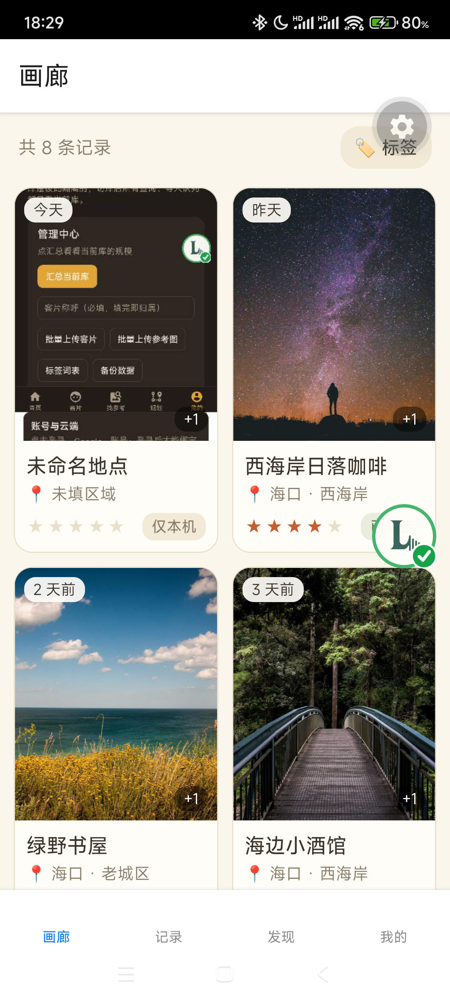
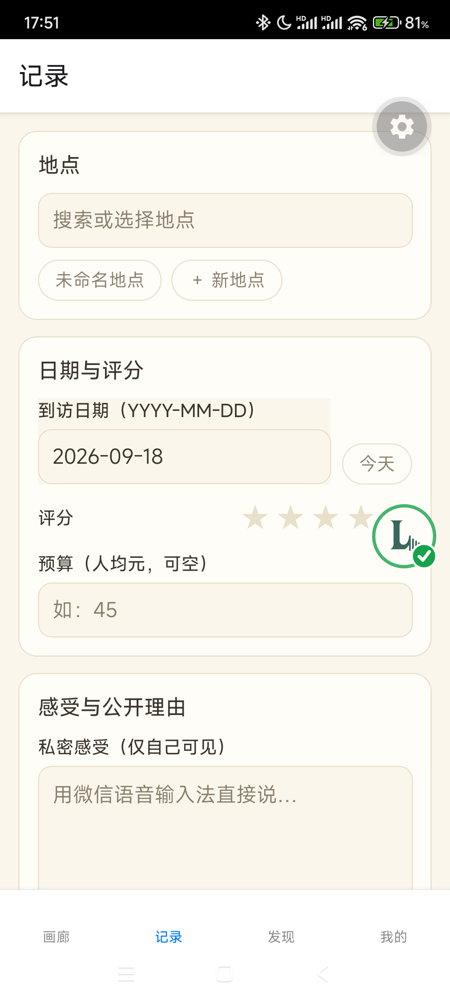
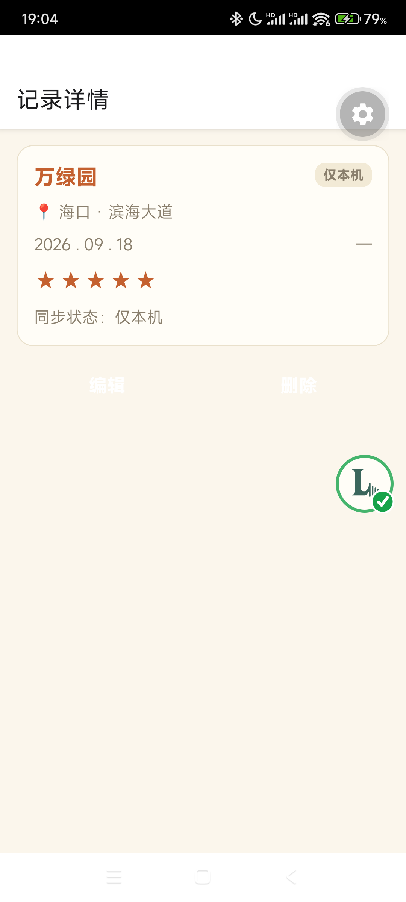

# 作业提交材料｜Place Journal（我的地点）

---

## 一、一句话介绍

**Place Journal 是一个 Android 端的私人「地点手账」App：拍照加写下当时的感受，就能记录一家去过的店；数据先存进手机本地数据库，登录后同步到云端；之后可以按地点、标签、评分随时回顾，还能生成分享链接发给朋友。**

---

## 二、App 运行截图（3 张）

**图 1｜画廊首页**——所有记录按时间倒序排列，显示封面照片、地点名、区域和评分。

**图 2｜记录页**——新增一条记录：选地点、填日期、评分、人均消费和感受。

**图 3｜记录详情**——保存后重新打开，这条记录从数据库里读出来展示。

> 截图均在真机（Redmi Note 12 Pro / Android 14）上实拍，画面里是演示数据。

---

## 三、App 页面结构说明

App 用 Expo Router 做页面路由，底部有 **4 个主页面**：画廊（首页列表）、记录（新增记录）、发现（搜索筛选）、我的（账号与同步状态）。

另外还有 **8 个二级页面**：记录详情、地点时间线、AI 整理、标签管理、冲突裁决、分享管理、分享快照、登录回调。

---

## 四、核心功能说明

1. **记录**：选地点（可现场新建）、拍照或多选图片、填日期、评分、人均消费和感受，一键保存。
2. **本地优先保存**：记录和照片先写进手机本地数据库，同时进入待同步队列，所以没网、没登录也能正常记录，杀进程不会丢数据。
3. **云同步**：登录后按固定顺序把数据同步到云端（先建地点、再写记录、再传照片），带版本号做乐观锁防止互相覆盖；真有冲突时让用户自己选保留哪一份。
4. **回顾与检索**：按地点、标签、评分档位或一句话关键词找记录，离线也能用。
5. **AI 整理**（可选）：可以把随手写的感受交给 AI，整理成评分、人均和标签，确认后再保存；接口不可用时自动跳过，不影响手工保存。
6. **分享**：选几个地点生成只读分享链接；私密感受永远不会出现在分享内容里，分享可随时撤销。

---

## 五、接入了什么数据库

用的是**本地数据库 + 云端数据库**双库方案。

- **本地：SQLite**（通过 `expo-sqlite`），共 11 张表，存地点、记录、照片、标签、待同步队列等，支持离线读写。
- **云端：Supabase**（PostgreSQL），独立 Schema `habit_tracker`，共 8 张表，所有表都启用了行级安全（RLS）按用户隔离；照片存在 Supabase Storage 里。
- **数据闭环**：在记录页新增一条记录 → 存进本地 SQLite → 回到画廊首页和详情页能读出来展示 → 登录后同步到 Supabase，换设备或网页端也能看到。
